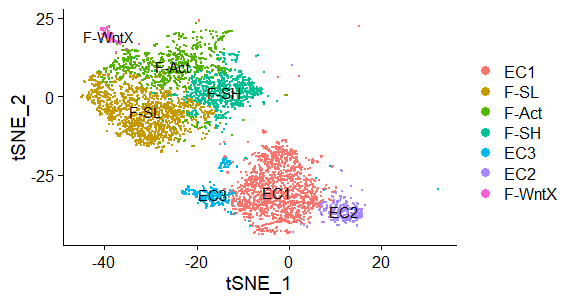
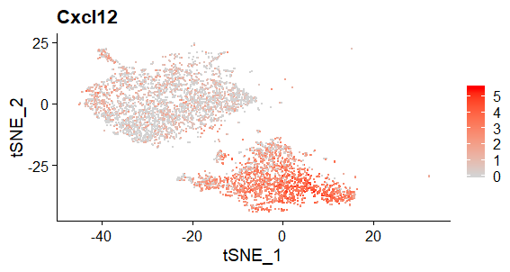
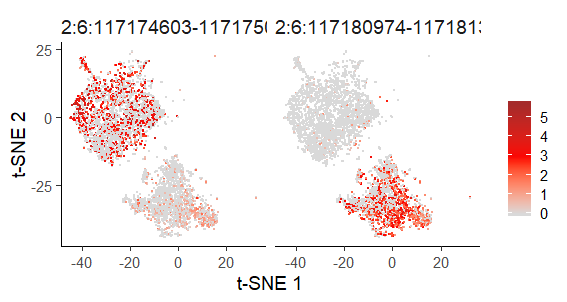
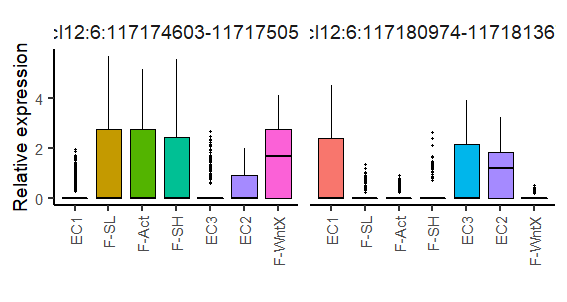
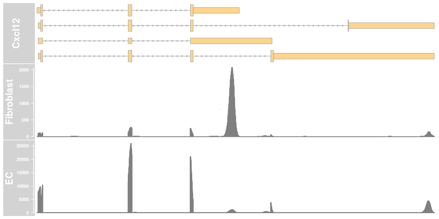

```{r setup,echo=FALSE}
library(knitr)
library(BiocStyle)

#Color Format
colFmt = function(x,color){
  outputFormat = knitr::opts_knit$get("rmarkdown.pandoc.to")
  if(outputFormat == 'latex')
    paste("\\textcolor{",color,"}{",x,"}",sep="")
  else if(outputFormat == 'html')
    paste("<font color='",color,"'>",x,"</font>",sep="")
  else
    x
}

```


# Introduction

Single cell RNA sequencing is a powerful technology that is utilised to extract gene expression information from thousands of cells. There are a number of described single cell RNA-Seq methods many are based on the principle of capturing and sequencing the 3' end of transcripts. 

Bioinformatic pipelines for single cell RNA seq typically start with the building of a gene count matrix from which secondary analysis can be performed on. This matrix is built by counting sequence reads that align within exonic coordinates of each gene. It is important to realise that this step involves the collapsing of all transcript isoforms for each gene, allowing total quantification of gene expression at the expense of isoform expression. 

The Sierra pipeline provides a novel quantification pipeline for single cell polyA data sets. Sierra scans for piles of sequence reads (i.e. peaks) across the whole data set and then quantifies with the boundaries of the peaks for each cell type. This approach provides positional information of sequencing data which relates to UTR usage and transcript isoform expression.


# Sierra Installation

Sierra can be installed from github


```
install.packages("devtools")
devtools::install_github("VCCRI/Sierra", build = TRUE, build_vignettes = TRUE, build_opts = c("--no-resave-data", "--no-manual"))

library(Sierra)
```


# Preparing input data sets

For this vignette, we will be using cardiac scRNA-seq from [Farbehi et al.](https://elifesciences.org/articles/43882). This study profiled cardiac interstitial cells from the hearts of mice subject to a myocardial infarction (MI) injury or sham control surgery. For the purpose of this vignette we have provided a small subset of the data from the sham condition and one of the MI time-points.    

## Required inputs


### BAM file
BAM files should be created from CellRanger or an equivalent program. Sierra requires BAM files to include two meta-data field tags, unique molecular identifier (UMI tag ``UB:Z``) and cell barcode (tag ``CB:Z``), which enables cell type identification and peak quantification.

### Splice junctions file
A BED formatted file that represents splice junctions that occur within the BAM file. This file can be created using the regtools program which needs to be run from your system command line. We specify the strand of the reads using the option ``-s 1`` (first-strand/RF). Below is an example of command line syntax that will generate the required output file. Note for the purposes of this vignette this step can be skipped as both output files, ``Vignette_example_TIP_sham_junctions.bed`` and ``Vignette_example_TIP_MI_junctions.bed``, have already been precomputed.


```
# The following are system commands to run regtools.
# BAM file from Sham 
regtools junctions extract -s 1 Vignette_example_TIP_sham.bam -o Vignette_example_TIP_sham_junctions.bed
# BAM file from myocardial infarction
regtools junctions extract -s 1 Vignette_example_TIP_MI.bam -o Vignette_example_TIP_MI_junctions.bed

```

### Reference annotation file

The Sierra pipeline requires a gene transfer formatted (GTF) file. Ideally this should be same GTF as provided in the alignment step. If CellRanger was used to align the data use the ``genes.gtf`` file contained within the CellRanger reference package.

### Cell barcodes whitelist file

Sierra requires a list of valid cell barcodes from your experiment to perform counting. If using CellRanger, this will be the barcodes.tsv file produced in the 'filtered_gene_bc_matrices_mex' folder, for example. 

### Vignette example files
For this vignette we have produced a number of reduced files. This includes a reduced GTF file containing a subset of genes, a reduced BAM file, peak file and a whitelist of barcodes identifying the single cells to include in the analysis. The following R code define the location of the vignette example files. 

```
extdata_path <- system.file("extdata",package = "Sierra")
reference.file <- paste0(extdata_path,"/Vignette_cellranger_genes_subset.gtf")
junctions.file <- paste0(extdata_path,"/Vignette_example_TIP_sham_junctions.bed")
bamfile <- c(paste0(extdata_path,"/Vignette_example_TIP_sham.bam"),
            paste0(extdata_path,"/Vignette_example_TIP_MI.bam") )
whitelist.bc.file <- c(paste0(extdata_path,"/example_TIP_sham_whitelist_barcodes.tsv"),
            paste0(extdata_path,"/example_TIP_MI_whitelist_barcodes.tsv"))
```


# Pipeline

Peak calling >> merging >> counting >> visualisation 

## Peak calling

Peak calling is performed on each BAM file. As previously mentioned a number of files are required to perform this task. 


```
library(Sierra)

peak.output.file <- c("Vignette_example_TIP_sham_peaks.txt",
                      "Vignette_example_TIP_MI_peaks.txt")
FindPeaks(output.file = peak.output.file[1],   # output filename
          gtf.file = reference.file,           # gene model as a GTF file
          bamfile = bamfile[1],                # BAM alignment filename.
          junctions.file = junctions.file,     # BED filename of splice junctions exising in BAM file. 
          ncores = 1)                          # number of cores to use
          
          
FindPeaks(output.file = peak.output.file[2],   # output filename
          gtf.file = reference.file,           # gene model as a GTF file
          bamfile = bamfile[2],                # BAM alignment filename.
          junctions.file = junctions.file,     # BED filename of splice junctions exising in BAM file. 
          ncores = 1)                          # number of cores to use


```
The FindPeaks function will print status updates as shown below as it progresses through the data file.

`r colFmt("
Import genomic features from the file as a GRanges object ... OK<br>
Prepare the 'metadata' data frame ... OK<br>
Make the TxDb object ... OK<br>
15 gene entries to process<br>
There are 202 unfiltered sites and 201 filtered sites<br>
There are 201 sites following duplicate removal
",'red')`


## Peak merging

If you have multiple samples and therefore BAM files, run FindPeaks on each BAM individually. A unified set of peak coorindates from all samples can be then created using the ``MergePeakCoordinates`` function. This step can also utilise multithreading.

```

### Read in the tables, extract the peak names and run merging ###

peak.dataset.table = data.frame(Peak_file = peak.output.file,
  Identifier = c("TIP-example-Sham", "TIP-example-MI"), 
  stringsAsFactors = FALSE)

peak.merge.output.file = "TIP_merged_peaks.txt"
MergePeakCoordinates(peak.dataset.table, output.file = peak.merge.output.file, ncores = 1)

```


## Counting per peak 

After you finish peak calling, you will have a file with the peak location information and we can now recount the data to create a per peak counts table. The code below may take a few minutes to run.

 

``` 

count.dirs <- c("example_TIP_sham_counts", "example_TIP_MI_counts")

#sham data set
CountPeaks(peak.sites.file = peak.merge.output.file, 
           gtf.file = reference.file,
           bamfile = bamfile[1], 
           whitelist.file = whitelist.bc.file[1],
           output.dir = count.dirs[1], 
           countUMI = TRUE, 
           ncores = 4)

# MI data set
CountPeaks(peak.sites.file = "TIP_merged_peaks.txt", 
           gtf.file = reference.file,
           bamfile = bamfile[2], 
           whitelist.file = whitelist.bc.file[2],
           output.dir = count.dirs[2], 
           countUMI = TRUE, 
           ncores = 4)

```

### Aggregate multiple count data-sets

If you have multiple BAM files the count matrices can be aggregated together using ``AggregatePeakCounts``. This function will append an experiment-specific label to the cell barcodes, by default a number according to the number of experiments, though here we define the labels (using the exp.labels variable) according to experimental condition. It's important to note for downstream analysis that if you want to combine Sierra peak counting with prior clustering the barcode labels will need to match what you currently have. If you have processed your data using the CellRanger aggr function, by inputting you data-files to ``AggregatePeakCounts`` in the same order, and leaving exp.labels blank, the barcodes should match. If you prefer to manually modifiy the barcodes prior to running ``AggregatePeakCounts`` you can turn off this function by setting update.labels = FALSE. See ``?AggregatePeakCounts`` for more details.

```
# As previously defined
peak.merge.output.file <- "TIP_merged_peaks.txt"
count.dirs <- c("example_TIP_sham_counts", "example_TIP_MI_counts")


# New definition
out.dir <- "example_TIP_aggregate"

# Now aggregate the counts for both sham and MI treatments
AggregatePeakCounts(peak.sites.file = peak.merge.output.file,
                    count.dirs = count.dirs,
                    exp.labels = c("Sham", "MI"),
                    output.dir = out.dir)

```
## Annotate peaks
Finally we want to annotate the peaks for genomic features. This is done using the ``AnnotatePeaksFromGTF``  function. The annotation step will identify if peaks overlap exons, introns or UTRs. Additionally each peak is analysed to determine if it possibly is derived from A or T  rich regions. The function therefore requires access to the genome sequence which can be installed from Bioconductor. Below is the required R code to download human or mouse genomes.

The following commands will install genome packages onto your local computer. These packages are large and may take a little time to download. Note that for this vignette only the mouse genome (mm10) is required. 

```
if (!requireNamespace("BiocManager", quietly = TRUE))
    install.packages("BiocManager")

# Mouse genome (mm10)
BiocManager::install("BSgenome.Mmusculus.UCSC.mm10")

# Human genome (hg38) - not required for this vignette
BiocManager::install("BSgenome.Hsapiens.UCSC.hg38")

```

We are now ready to input the peak coordinates to ``AnnotatePeaksFromGTF`` For this example we used the output from ``MergePeakCoordinates``, but if you only have one sample to analyse use the output from FindPeaks. ``AnnotatePeaksFromGTF`` takes as input the peak coordiantes file, GTF file and genome file in addition to an output file name. The genome file is optional if you want to skip sequence annotation, which will take a while for a large number of peaks. 

```
# As previously defined
peak.merge.output.file <- "TIP_merged_peaks.txt"
extdata_path <- system.file("extdata",package = "Sierra")
reference.file <- paste0(extdata_path,"/Vignette_cellranger_genes_subset.gtf")

# New definitions
genome <- BSgenome.Mmusculus.UCSC.mm10::BSgenome.Mmusculus.UCSC.mm10

AnnotatePeaksFromGTF(peak.sites.file = peak.merge.output.file, 
                     gtf.file = reference.file,
                     output.file = "TIP_merged_peak_annotations.txt", 
                     genome = genome)
```

## Detecting and visualising differential transcript usage
For differential usage testing we first create an object to hold the peak count and annotation information. Sierra can interface with either Seurat or the Bioconductor Single-Cell Experiment (SCE) class. Once the peak object has been created, the same functions will work with either a Seurat or SCE based object. Here we will demonstrate the main Sierra functions using Seurat - see below for creating a Sierra object with SCE.

Note that for Seurat, we require a minimum of version 3 for compatibility with Sierra. To install Seurat please see instructions at the [Seurat home page](https://satijalab.org/seurat/). 

There are two ways to create a Seurat object of peak counts. The first involves transferring cluster IDs and dimensionality reductions (t-SNE and/or UMAP) from an existing Seurat object using the ``PeakSeuratFromTransfer`` function - this is useful if you have performed gene-level clustering in Seurat and want to test for DTU between your cell populations. You can also create a new Seurat object, with the option to pass cluster IDs and dimensionality reduction coordinates. We will demonstrate both approaches below. 

First we need to read in the peak counts and annotation file. To demonstrate ``PeakSeuratFromTransfer`` we will also load up a reduced gene-level Seurat object of the heart data, which contains pre-computed clusters and t-SNE coordinates. 

```
library(Seurat)

#Previous definitions
out.dir <- "example_TIP_aggregate"
extdata_path <- system.file("extdata",package = "Sierra")

#Read in the counts
peak.counts <- ReadPeakCounts(data.dir = out.dir)

#Read in peak annotations
peak.annotations <- read.table("TIP_merged_peak_annotations.txt", 
                               header = TRUE,
                               sep = "\t",
                               row.names = 1,
                               stringsAsFactors = FALSE)
head(peak.annotations)

#Load precompiled gene-level object called 'genes.seurat'
load(paste0(extdata_path,"/TIP_vignette_gene_Seurat.RData"))
```

We now create the peak-level Seurat object using the transfer function. ``PeakSeuratFromTransfer`` will perform some basic filtering of the data, including filtering out peaks expressed below some minimum number of cells and cells expressing a minimum number of peaks. Note that since we're using a reduced matrix for the vignette we're setting min.cells and min.peaks to 0 to avoid everything being filtered out.

```
peaks.seurat <- PeakSeuratFromTransfer(peak.data = peak.counts, 
                                       genes.seurat = genes.seurat, 
                                       annot.info = peak.annotations, 
                                       min.cells = 0, min.peaks = 0)
```


The alternative is to create a new peak object with ``NewPeakSCE``. If cluster IDs and dimensionality reduction coordinates are available they can be passed to the object - which we will do for this example. This isn't neccessary if, for example, you want to try clustering using the peak counts.

```
load(paste0(extdata_path,"/TIP_cell_info.RData"))
peaks.seurat <- NewPeakSeurat(peak.data = peak.counts, 
                              annot.info = peak.annotations, 
                              cell.idents = tip.populations, 
                              tsne.coords = tip.tsne.coordinates,
                              min.cells = 0, min.peaks = 0)
```

The peak-count Seurat object stores the annotation information in the tools slot, and can be accessed with the Seurat ``Tool`` function - as an example try running ``head(Tool(peaks.seurat, "Sierra"))``. The peak-count Seurat object is compatible with standard Seurat functions; for example, a t-SNE plot of cell populations can be drawn using the ``DimPlot`` function:


```
DimPlot(peaks.seurat, reduction = 'tsne', label = TRUE, pt.size = 0.5)
```

For this example data-set there are four fibroblast clusters (F-SL, F-SH, F-Act and F-WntX) and three endothelial cell (EC) clusters. 

```{r DimPlot, out.width='100%', fig.cap = 'DimPlot output',echo=FALSE}

```


### Testing for differential transcript usage


Differential peak usage analysis is performed using the ``DUTest`` function. This utilises the DEXSeq package to test for differences in relative peak usage between cell populations, after creating pseudo-bulk profiles from the cells to define replicates. 

``DUTest`` takes in the peaks object and either a population ID or a list of cell barcode IDs. population.2 can be left unspecified and the function will test for population.1 vs everything else. For this test we'll compare the two biggest fibroblast and endothelial cell (EC) clusters, 'F-SL' and 'EC1', respectively.

```
res.table = DUTest(peaks.seurat, 
                   population.1 = "F-SL", 
                   population.2 = "EC1",
                   exp.thresh = 0.1, 
                   feature.type = c("UTR3", "exon"))
```


DUTest filters results according to a default adjusted P-value threshold (0.05) and 
log2 fold-change threshold (0.25) prior to returning the results. These thresholds can be modified,
or we can subset the results data-frame for the top results. 

```
res.table.top <- subset(res.table, abs(Log2_fold_change) > 1)
head(res.table.top)
```

### Visualising relative peak expression

In order to visualise the relative usage of the peaks, Sierra has functionality for plotting 'relative expression', where the expression of a set of peaks in a gene is transformed according to the relative usage of the peaks within each cell population. As an example, we will plot the top gene coming up from the fibroblast vs EC analysis: Cxcl12. For this gene, two peaks are coming up as significant with log2 fold-change > 1. For comparison we will first plot the gene expression:


```
# Plotting gene expression using the Seurat FeaturePlot function
Seurat::FeaturePlot(genes.seurat, "Cxcl12", cols = c("lightgrey", "red"))

```

```{r FeaturePlot, out.width='100%', fig.cap = 'Seurat FeaturePlot  output',echo=FALSE}

```


Now select the peaks of interest, and plot their relative expression using the ```PlotRelativeExpressionTSNE``` function: 

```
# Select top peaks DU within the Cxcl12 gene
peaks.to.plot <- rownames(subset(res.table.top, gene_name == "Cxcl12"))

PlotRelativeExpressionTSNE(peaks.seurat, peaks.to.plot = peaks.to.plot)
```

```{r PlotRelativeExpressionTSNE, out.width='100%', fig.cap = 'PlotRelativeExpressionTSNE output',echo=FALSE}

```


Sometimes only one peak will be called as significant. If you want to compare to other peaks they can be retrieved for plotting using the ``SelectGenePeaks`` function


```
all.peaks <- SelectGenePeaks(peaks.seurat, gene = "Cxcl12", feature.type = c("UTR3", "exon"))
```


Sierra has 4 functions for plotting relative expression:

1. PlotRelativeExpressionTSNE
2. PlotRelativeExpressionUMAP
3. PlotRelativeExpressionBox
4. PlotRelativeExpressionViolin

Let's see what a box plot looks like:

```
PlotRelativeExpressionBox(peaks.seurat, peaks.to.plot = peaks.to.plot)
```

```{r PlotRelativeExpressionBox, out.width='100%', fig.cap = 'PlotRelativeExpressionBox output',echo=FALSE}

```


## Sierra coverage plots

Next we want to see what the differential peaks correspond to. For that use the ``PlotCoverage`` function.
First we need to extract the relevant cell populations from the aggregate BAM file, which can be done in Sierra using the ``SplitBam`` function.
Note that extracting cell populations can be memory consuming when extracting a large number 
of cells. An alternative is to extract specific genes to plot, or to extract using smaller numbers of cells then merging the BAM files together. Here we will extract a gene to plot for comparing a combination  of fibroblast and EC populations from the 'sham' BAM file. ``SplitBam`` requires as input a data-frame of cell types ('celltype') and cell barcode ('cellbc') in addition to the BAM file to be subsetted.

```
# Will be subsetting the sham condition BAM, so first will 
# add experimental conditions to the Seurat object
Condition <- data.frame(Condition = sub(".*-(.*)", "\\1", 
                        colnames(peaks.seurat)),
                        row.names = colnames(peaks.seurat))
peaks.seurat <- AddMetaData(peaks.seurat, metadata = Condition, 
                            col.name = "Condition")

peaks.seurat <- subset(peaks.seurat, subset = Condition == "Sham")
cells.df <- as.data.frame(Idents(peaks.seurat))
cells.df$cellbc = rownames(cells.df)
colnames(cells.df) <- c("celltype", "cellbc")

# Make sure cell barcodes match what is in the original BAM file:
cells.df$cellbc <- sub("(.*)-.*", "\\1", cells.df$cellbc)
cells.df$cellbc <- paste0(cells.df$cellbc, "-1")
```

``SplitBam`` will return subsetted BAM files accoding to the unique identities in the 'celltype' column. For this example we will combined the fibroblast and EC clusters together:
```
cells.df <- subset(cells.df, celltype %in% c("F-SL", "F-SH", "EC1", "EC2", "EC3"))
cells.df$celltype <- droplevels(cells.df$celltype)
cells.df$celltype <- plyr::mapvalues(cells.df$celltype,
                                     from=c("F-SL", "F-SH", "EC1", "EC2", "EC3"),
                                     to=c("Fibroblast", "Fibroblast", "EC", "EC", "EC"))
```

We can now run ``SplitBam`` using the sham condition BAM file that has been defined previously:       
```                                    
outdir = "bam_subsets/"
dir.create(outdir)
SplitBam(bamfile[1], cells.df, outdir)
```

Alternatively to extract for a single gene:

```
gtf_gr <- rtracklayer::import(reference.file)
SplitBam(bam = bamfile[1],
         cellbc.df = cells.df,
         outdir = outdir, 
         gtf_gr = gtf_gr,
         geneSymbol = "Cxcl12")
```


Now we have the cell type-specific BAMs, we can plot read coverage across a gene
 between the fibroblast and ECs. This is done using the ``PlotCoverage`` function.

First define BAM files in order of plotting:

```
bam.files <- paste0(outdir, c("Fibroblast.Cxcl12.bam", "EC.Cxcl12.bam"))
```

Now run the PlotCoverage function:

```
PlotCoverage(genome_gr = gtf_gr, 
             geneSymbol = "Cxcl12", 
             genome = "mm10",
             bamfiles = bam.files,
             bamfile.tracknames=c("Fibroblast", "EC"))
```

The coverage plot shows the gene model in the top followed by read coverage for the fibroblasts and ECs. We can see in this example that one of the DU peaks corresponds to expression of a short Cxcl12 transcript isoform in fibroblasts and preferential expression of a longer isoform in ECs. 

```{r SplitBam, out.width='100%', fig.cap = 'PlotCoverage output',echo=FALSE}

```

For larger genes and more cells it can be best to send the output straight to PDF. To do this set pdf_output = TRUE and specify output_file_name:

```
PlotCoverage(genome_gr = gtf_gr, 
             geneSymbol = "Cxcl12", 
             genome = "mm10",
             pdf_output = TRUE, 
             bamfiles = bam.files,
             bamfile.tracknames=c("Fibroblast", "EC"),
             output_file_name = "Cxcl12_fibroblast_vs_ECs example.pdf")
```          
             
             

## Working with the Single-Cell Experiment class

```
# Read in the counts

peak.counts <- ReadPeakCounts(data.dir = "example_TIP_aggregate")

# Read in peak annotations
peak.annotations <- read.table("TIP_merged_peak_annotations.txt", 
                               header = TRUE,
                               sep = "\t",
                               row.names = 1,
                               stringsAsFactors = FALSE)

# Input is the same as for using the NewPeakSeurat function
load(paste0(extdata_path,"/TIP_cell_info.RData"))
peaks.sce <- NewPeakSCE(peak.data = peak.counts, 
                        annot.info = peak.annotations, 
                        cell.idents = tip.populations, 
                        tsne.coords = tip.tsne.coordinates,
                        min.cells = 0, min.peaks = 0)

# the DUTest and visualisation functions are run the same as above
res.table = DUTest(peaks.sce, population.1 = "F-SL", population.2 = "EC1",
                   exp.thresh = 0.1, feature.type = c("UTR3", "exon"))

res.table.top <- subset(res.table, abs(Log2_fold_change) > 1)
head(res.table.top)

# Relative expression plot
peaks.to.plot <- rownames(subset(res.table.top, gene_name == "Cxcl12"))
PlotRelativeExpressionTSNE(peaks.sce, peaks.to.plot = peaks.to.plot)

# Selecting peaks according to gene
all.peaks <- SelectGenePeaks(peaks.sce, gene = "Cxcl12", feature.type = c("UTR3", "exon"))
print(all.peaks)

# Relative expression box plot
PlotRelativeExpressionBox(peaks.sce, peaks.to.plot = peaks.to.plot)
```

#  Detecting specific forms of differential transcript usage

Sierra provides some functions for detecting some specific forms of DTU - specifically,
changes in 3'UTR length and alternative 3'-end use. 

## Detecting shifts in 3'UTR length

The function to evaluate shifts in 3'UTR length between cell populations is called `DetectUTRLengthShift`. This will perform DU testing on 3'UTR peaks, first filtering for peaks annotated as proximal to A-rich regions (in order to enrich for real polyA sites). For DTU genes, it selects for those that have multiple peaks on the same 3'UTR. Each DU peak is ranked according to its position from the termination exon, according to the total number of peaks on the 3'UTR - this information is used in the following step below to infer global changes in 3'UTR length. In addition to defining cell population(s) to test, `DetectUTRLengthShift` requires as input the reference information used above for annotation: 

```
reference.file <- paste0(extdata_path,"/Vignette_cellranger_genes_subset.gtf")
gtf_gr <- rtracklayer::import(reference.file)
gtf_TxDb <- GenomicFeatures::makeTxDbFromGFF(reference.file, format="gtf")
res.table <- DetectUTRLengthShift(peaks.object = peaks.seurat, 
                                  gtf_gr = gtf_gr,
                                  gtf_TxDb = gtf_TxDb,
                                  population.1 = "F-SL", 
                                  population.2 = "EC1")
```

The output table of `DetectUTRLengthShift` is similar to `DUTest`, though with some additional columns of information relating to the peak position on the 3'UTR. The results table can be used as input to the `PlotUTRLengthShift` function to visualise global patterns of 3'UTR length shifts between the cell populations. By default, `PlotUTRLengthShift` will also perform a statistical test to determine whether there is a shift in relative peak location between the upregulated and downregulated peaks. 

The above example only contains a few significant peaks, so is not a great example for the visualisation. Instead we will use a precomputed results table of proliferating versus resting fibroblasts (proliferating cells have been observed in several studies to have shortened 3'UTRs).

```
# Read in pre-calculated results table for this example
results.file <- paste0(extdata_path,"/Cycling_vs_resting_fibro_UTR_length_res.RData")
load(results.file)

# Plot global shift in 3'UTR length 
PlotUTRLengthShift(res.table)
```

```{r PlotUTRLengthShift, out.width='100%', fig.cap = 'PlotUTRLengthShift output',echo=FALSE}
knitr::include_graphics('UTRLengthPlot.png')
```

## Detecting alternative 3'-end usage

Another form of DTU that can be observed based on polyA sites is alternative 3'-end usage, such as the Cxcl12 example illustrated above. Sierra implements a function that tests for alternative 3'-end use by first evaluating DTU genes using peaks on 3' UTRs, then determining whether the DTU genes have peaks on distinct 3'UTRs, which would correspond to at least one transcript being differential. This is implemented in the function `DetectAEU`:

```
reference.file <- paste0(extdata_path,"/Vignette_cellranger_genes_subset.gtf")
gtf_gr <- rtracklayer::import(reference.file)
gtf_TxDb <- GenomicFeatures::makeTxDbFromGFF(reference.file, format="gtf")
res.table <- DetectAEU(peaks.object = peaks.seurat, 
                       gtf_gr = gtf_gr,
                       gtf_TxDb = gtf_TxDb,
                       population.1 = "F-SL", 
                       population.2 = "EC1")
```

# Session Information-----------------------------------

```{r sessionInfo}
sessionInfo()
```


